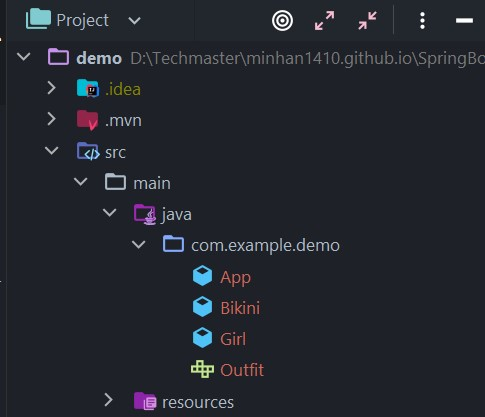

# **Cách chạy ứng dụng Spring Boot**

Nếu trong `Java` truyền thống, khi chạy cả một project, chúng ta sẽ phải định nghĩa một hàm `main()` và để nó khởi chạy đầu tiên. Điều này không có gì thay đổi, có khác là chúng ta sẽ phải chỉ cho `Spring Boot` biết nơi nó khởi chạy lần đầu, để nó cài đặt mọi thứ.

Cách thực hiện là thêm annotation `@SpringBootApplication` trên class chính và gọi `SpringApplication.run(App.class, args);` để chạy project.

```java
import org.springframework.boot.SpringApplication;
import org.springframework.boot.autoconfigure.SpringBootApplication;
import org.springframework.context.ApplicationContext;

@SpringBootApplication
public class App {
    public static void main(String[] args) {
        SpringApplication.run(App.class, args);
    }
}
```

Đọc bài [Giải thích Dependency Injection (DI) và IoC](Lesson1_DI_IOC.md). Bạn sẽ hiểu, **một trong những nhiệm vụ chính của `Spring` là tạo ra một cái `Container` chứa các `Dependency` cho chúng ta**.

`SpringApplication.run(App.class, args);` chính là câu lệnh để tạo ra **container**. Sau đó nó tìm toàn bộ các **dependency** trong project của bạn và đưa vào đó.

**Spring** đặt tên cho **container** là `ApplicationContext` và đặt tên cho các **dependency** là `Bean`

_VD_

```java
@SpringBootApplication
public class App {
    public static void main(String[] args) {
        // ApplicationContext chứa toàn bộ dependency trong project.
        ApplicationContext context = SpringApplication.run(App.class, args);
    }
}
```

_Hình ảnh minh họa ApplicationContext vs Bean:_


# **Component**

`@Component` là một [Annotation(chú thích)](https://loda.me/articles/huong-dan-tu-tao-mot-annotations) đánh dấu trên các `Class` để giúp `Spring` biết nó là một `Bean`

_VD:_



_Đầu tiên chúng ta có một **interface** `Outfit`_

```java
public interface Outfit {
    public void wear();
}
```

_Tiếp theo tạo **class** `Bikini` **implements interface** `Outfit`_

```java
/*
 Đánh dấu class bằng @Component
 Class này sẽ được Spring Boot hiểu là một Bean (hoặc dependency)
 Và sẽ được Spring Boot quản lý
*/
@Component
public class Bikini implements Outfit {
    @Override
    public void wear() {
        System.out.println("Mặc bikini");
    }
}
```

_Chạy chương trình, và xem kết quả:_

```java
@SpringBootApplication
public class App {
    public static void main(String[] args) {
        // ApplicationContext chính là container, chứa toàn bộ các Bean
        ApplicationContext context = SpringApplication.run(App.class, args);

        // Khi chạy xong, lúc này context sẽ chứa các Bean có đánh dấu @Component (nói nôm na là trong context chứa Bikini)

        // Lấy Bean ra bằng cách
        Outfit outfit = context.getBean(Outfit.class);

        // In ra để xem thử nó là gì
        System.out.println("Instance: " + outfit);
        // xài hàm wear()
        outfit.wear();
    }
}
```

_Output:_

```
[1] Instance: com.example.demo.Bikini@23566a21 Mặc bikini
[2] Mặc bikini
```

Bạn sẽ thấy `Outfit` lúc này chính là `Bikini` (**Class** đã được đánh dấu là `@Component`)

**Spring Boot** khi chạy sẽ dò tìm toàn bộ các **Class** cùng cấp hoặc ở trong các **package** thấp hơn so với **class** `App` mà bạn cung cấp cho **Spring** (Chúng ta có thể cấu hình việc tìm kiếm này, sẽ đề cập sau). Trong quá trình dò tìm này, khi gặp một **class** được đánh dấu `@Component` thì nó sẽ tạo ra một instance và đưa vào `ApplicationContext` để quản lý.

_Quá trình chạy sẽ như sau:_


# **Autowired**

Bây giờ mình tạo ra một **Class** `Girl` và có một **thuộc tính** là `Outfit`. Mình cũng đánh dấu `Girl` là một `@Component`.

Tức **Spring Boot** cần tạo ra một **instance** của `Girl` để quản lý.

```java
@Component
public class Girl {

    @Autowired
    Outfit outfit;

    public Girl(Outfit outfit) {
        this.outfit = outfit;
    }

    // GET
    // SET
}
```

Mình đánh dấu **thuộc tính** `Outfit` của `Girl` bởi **annotation** `@Autowired`.

Điều này nói với **Spring Boot** hãy tự **inject** (tiêm) một **instance** của `Outfit` vào thuộc tính này khi khởi tạo `Girl`.

_Lúc này, chạy thử chương trình_

```java
@SpringBootApplication
public class App {
    public static void main(String[] args) {
        // ApplicationContext chính là container, chứa toàn bộ các Bean
        ApplicationContext context = SpringApplication.run(App.class, args);

        // Khi chạy xong, lúc này context sẽ chứa các Bean có đánh dấu @Component (nói nôm na là trong context chứa Bikini)

        // Lấy Bean ra bằng cách
        Outfit outfit = context.getBean(Outfit.class);

        // In ra để xem thử nó là gì
        System.out.println("Output Instance: " + outfit);
        // xài hàm wear()
        outfit.wear();

        // Mình cũng đánh dấu Girl là một @Component nên trong context cũng chứa Girl
        Girl girl = context.getBean(Girl.class);

        System.out.println("Girl Instance: " + girl);

        // Mình đánh dấu thuộc tính Outfit của Girl bởi annotation @Autowired (Điều này nói với Spring Boot hãy tự inject (tiêm) một instance của Outfit vào thuộc tính này khi khởi tạo Girl)
        System.out.println("Girl Outfit: " + girl.outfit);

        girl.outfit.wear();
    }
}
```

_Output:_

```
[1] Output Instance: com.example.demo.Bikini@1e9fc480
[2] Mặc bikini
[3] Girl Instance: com.example.demo.Girl@314f88cc
[4] Girl Outfit: com.example.demo.Bikini@1e9fc480
[5] Mặc bikini
```

**Spring Boot** đã tự tạo ra một `Girl` và trong quá trình tạo ra đó, nó truyền `Outfit` vào làm **thuộc tính**.

# **Singleton**

**Điều đặc biệt là các `Bean` được quản lý bên trong `ApplicationContext` đều là `singleton`.**

_Bạn chắc đã để ý điều này từ các Output ở phía trên?_

```
[1] Output Instance: com.example.demo.Bikini@1e9fc480

[4] Girl Outfit: com.example.demo.Bikini@1e9fc480
```

`Outfit` ở **2 đối tượng** trên là **một**.

Tất cả những `Bean` được quản lý trong `ApplicationContext` đều **chỉ được tạo ra một lần duy nhất** và khi có **Class** yêu cầu `@Autowired` thì nó sẽ lấy **đối tượng** có sẵn trong `ApplicationContext` để **inject** vào.

_Trong trường hợp bạn muốn mỗi lần sử dụng là một **instance hoàn toàn mới**_. Thì hãy đánh dấu `@Component` đó bằng `@Scope("prototype")`

```java
@Component
@Scope("prototype")
public class Bikini implements Outfit {
    @Override
    public void wear() {
        System.out.println("Mặc bikini");
    }
}
```

_Đọc thêm tại:_

**[Hướng dẫn @Component và @Autowired](https://loda.me/articles/sb1-huong-dn-component-va-autowired)**

**[Code](https://github.com/minhan1410/spring-boot-learning/tree/master/spring-boot-1-helloworld-%40Component-%40Autowired)**
