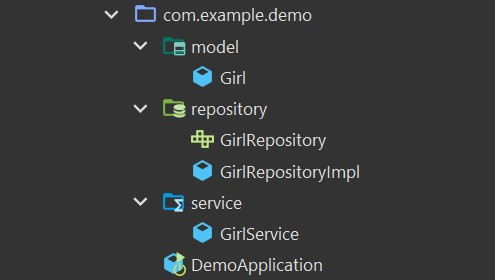

# **Kiến trúc trong Spring Boot**

Kiến trúc MVC trong Spring Boot được xây dựng dựa trên tư tưởng **độc lập** kết hợp với các nguyên lý thiết kế hướng đối tượng (một đại diện tiêu biểu là Dependency Inversion). Độc lập ở đây ám chỉ việc các layer phục vụ các mục đích nhất định, khi muốn thực hiện một công việc ngoài phạm vi thì sẽ đưa công việc xuống các layer thấp hơn.

Kiến trúc **Controller** - **Service** - **Repository** chia project thành 3 lớp:


**Consumer Layer hay Controller**: `là tầng giao tiếp với bên ngoài và handler các request từ bên ngoài tới hệ thống`.

**Service Layer**: `Thực hiện các nghiệp vụ và xử lý logic`

**Repository Layer**: `Chịu trách nhiệm giao tiếp với các DB, thiết bị lưu trữ, xử lý query và trả về các kiểu dữ liệu mà tầng Service yêu cầu.`

# **@Controller** vs **@Service** vs **@Repository**

Để phục vụ cho kiến trúc ở trên, Spring Boot tạo ra 3 Annotation là **@Controller** vs **@Service** vs **@Repository** để chúng ta có thể đánh dấu các tầng với nhau.

**@Service**: Đánh dấu một Class là tầng **Service**, `phục vụ các logic nghiệp vụ`.

**@Repository**: Đánh dấu một Class Là tầng **Repository**, `phục vụ truy xuất dữ liệu`.

Cấu trúc thư mục:



# **Code**

Đầu tiên tôi tạo ra một **model Girl**

```java
public class Girl {
    private String name;

    public Girl(String name) {
        this.name = name;
    }

    public String getName() {
        return name;
    }

    public void setName(String name) {
        this.name = name;
    }

    @Override
    public String toString() {
        return "Girl(" + this.name + ")";
    }
}
```

Tiếp theo tạo **interface GirlRepository** để giao tiếp với DB

```java
public interface GirlRepository {
    /**
     * Tìm kiếm một cô gái trong database theo tên
     * @param name
     * @return
     */
    Girl getGirlByName(String name);
}
```

Tạo **GirlRepositoryImpl** kế thừa **GirlRepository** và đánh dấu nó là **`@Repository`**

```java
@Repository
public class GirlRepositoryImpl implements GirlRepository {
    @Override
    public Girl getGirlByName(String name) {
        // Ở đây tôi ví dụ là database đã trả về một cô gái với tên đúng như tham số
        // Còn thực tế phải query trong csđl nhé.
        return new Girl(name);
    }
}
```

Tạo ra một class **GirlService** để giải quyết các logic nghiệp vụ. Lớp **GirlService** sẽ giao tiếp với DB thông qua **GirlRepository**

```java
@Service
public class GirlService {
    @Autowired
    private GirlRepository girlRepository;

    public Girl getRandomGirl(){
        // Random 1 cái tên độ dài 10
        String name = randomGirlName(10);

        // Gọi xuông tầng repository để query lấy một cô gái tên là "name" trong database
        return girlRepository.getGirlByName(name);
    }

    public String randomGirlName(int length) {
        // Random một string có độ dài quy định
        // Sử dụng thư viện Apache Common Lang
        return RandomStringUtils.randomAlphanumeric(length).toLowerCase();
    }
}
```

Chạy chương trình:

```java
@SpringBootApplication
public class DemoApplication {
    public static void main(String[] args) {
        ApplicationContext context = SpringApplication.run(DemoApplication.class, args);
        // Lấy ra bean GirlService
        GirlService girlService = context.getBean(GirlService.class);
        // Lấu ra random một cô gái từ tầng service
        Girl girl = girlService.getRandomGirl();
        // In ra màn hình
        System.out.println(girl);
    }
}
```

Output:

```
Girl(7f64u2h6dm)
```

# Giải thích

Về bản chất **@Service** và **@Repository** cũng chính là **@Component**. Nhưng đặt tên khác nhau để giúp chúng ta phân biệt các tầng với nhau.

Cùng nhìn vào source code của 2 Annotation này:

`Service.java`

```java
@Target({ElementType.TYPE})
@Retention(RetentionPolicy.RUNTIME)
@Documented
@Component // Cũng là một @Component
public @interface Service {
    @AliasFor(
        annotation = Component.class
    )
    String value() default "";
}
```

`Repository.java`

```java
@Target({ElementType.TYPE})
@Retention(RetentionPolicy.RUNTIME)
@Documented
@Component
public @interface Repository {
    @AliasFor(
        annotation = Component.class
    )
    String value() default "";
}
```

Trong các bài đầu tiên chúng ta đã biết **@Component** đánh dấu cho **Spring Boot** biết **Class** đó là **Bean**. Và hiển nhiên **@Service** và **@Repository** cũng vậy. Vì thế ở ví dụ trên chúng ta có thể lấy **GirlService** từ **ApplicationContext**.

Về bản chất thì bạn có thể sử dụng thay thế 3 **Annotation** **@Component**, **@Service** và **@Repository** cho nhau mà không ảnh hưởng gì tới code của bạn cả. Nó vẫn sẽ hoạt động.

Tuy nhiên từ góc độ thiết kế thì chúng ta cần phân rõ 3 **Annotation** này cho các **Class** đảm nhiệm đúng nhiệm vụ của nó.

**@Service** gắn cho các **Bean** `đảm nhiệm xử lý logic`

**@Repository** gắn cho các **Bean** `đảm nhiệm giao tiếp với DB`

**@Component** gắn cho các **Bean** khác.
